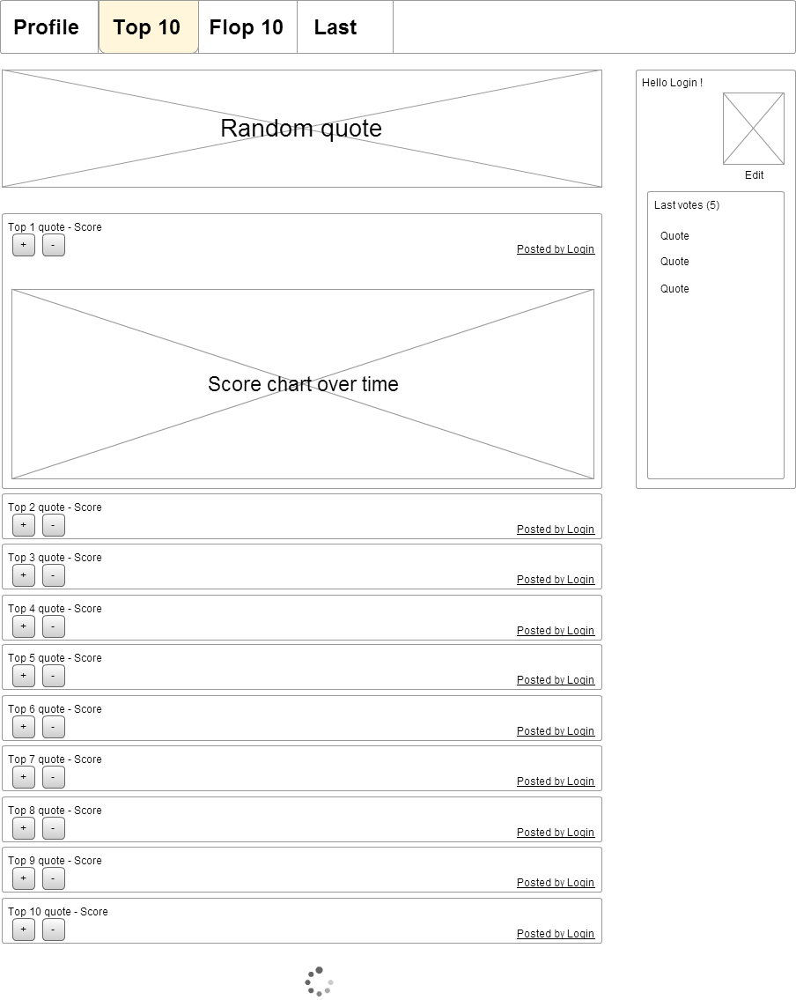

# quote service

HTTP API service for quote voting project sample

used Java, Spring Boot.

**The API allows:**

* addition, viewing (including a method to get a random quote), modification, and deletion of quotes. Quote properties include content, date of creation / update, link to user who posted it, link to votes;
* voting on quotes (either upvote or downvote);
* view of the top and worse 10 quotes, the details of each quote, and a graph of the evolution of the votes over time.

Provides a REST API for the web interface in the two wireframes below:

Does not include frontend part.

**Docker image:** apletenev/voting:quoteservice

**User service** - [here](https://github.com/APletenev/userservice)